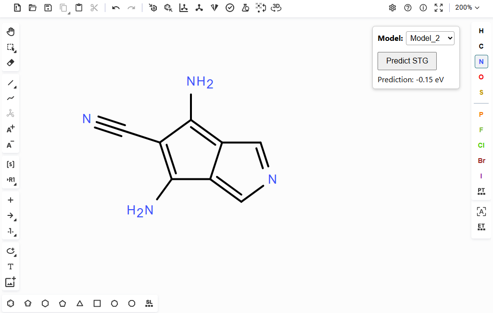

# ketcher-predict 

A modified Ketcher molecular editor with custom ML backend for molecular property prediction. Currently, the backend predicts the singlet-triplet gap (STG). The web application can be accessed [here](http://ketcher-predict.ttk.hu).

## STG Prediction

The methodology for STG prediction is published in our paper "Prediction of Singlet-Triplet Gaps Using Self-Attention–Based Regression with Model Integration into a Molecular Editor". 

The editor uses two of the ML models, which can be chosen from the drop-down menu in the prediction box of the interface. Model_2 is an implementation of the AttentiveFP graph-based model, while Model_6b is a custom GNN-transformer hybrid. The models were trained on [data](https://doi.org/10.1016/j.matt.2024.01.002) calculated with the ADC(2) electronic structure method. Model_2 is expected to have better performance for molecules similar to those in the training set, while Model_6b is better at generalization.

The main Jupyter notebook in the `STG_predictor` folder contains code for reproducibility: model definitions, hyperparameter optimization (HPO), cross-validation (CV), oneshot prediction, etc. The final figures and the outlier analysis can be found in the other notebooks.

Environment files for Conda are also included:
- `ml_env_cpu.yml` is for running notebooks on a windows PC
- `hybrid_model.yml` is the same env but for PCs with GPU
- `hybrid_model_script.yml` is the env we used for production runs (HPO, CV) on a Linux workstation

The saved model weights are stored in the Zenodo repository: 

## Running the App Locally

Running the application on a local PC is relatively simple and works under both Windows and Linux:
1) install Docker
2) clone/download the repository
3) get the saved model weights from [Zenodo](https://doi.org/10.5281/zenodo.22111316)
4) put `model2_trial_2.pt` and `model6b_trial_8.pt` in the backend folder
5) use a terminal to navigate to the downloaded folder
6) use `docker compose build` to build a docker image
7) then `docker compose up` to start a container
8) open http://localhost:8000/ in a browser

## Todo

We plan to keep improving the web server by updating Ketcher and adding new molecular properties to predict. We plan to stay at Ketcher version v2, since v3 added a macromolecules feature that the backend is not designed to utilize.

Present taks:
- update ketcher on the live server (v2.24.0 to v2.28.0)
- add HTTPS
